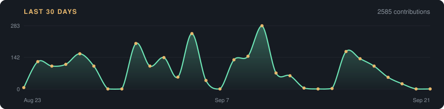

  <picture>
    <source media="(prefers-color-scheme: dark)" srcset="./assets/banner-dark.svg">
    <source media="(prefers-color-scheme: light)" srcset="./assets/banner-light.svg">
    
  </picture>

  
  &nbsp;&nbsp;
  
  &nbsp;&nbsp;
  
  &nbsp;&nbsp;
  

  <picture>
    <source media="(prefers-color-scheme: dark)" srcset="./assets/context-dark.svg">
    <source media="(prefers-color-scheme: light)" srcset="./assets/context-light.svg">
    
  </picture>

  Fullstack Founding Engineer at <a href="https://boldfit.com">Boldfit</a>
  · previously <a href="https://www.licious.in">Licious</a>,
  <a href="https://www.lenskart.com">Lenskart</a>,
  and threedots

---

<table>
  <tr>
    <td width="50%" valign="top">
      <strong>Licious — SDE II</strong> 
      Owned order, payment, wallet, and checkout services at 70K orders/day and 3000 req/s. Kafka event-driven path; JVM memory from 95% to 40%.
    </td>
    <td width="50%" valign="top">
      <strong>Lenskart — Software Developer</strong> 
      Led a POS platform across 2000+ stores (40% better inventory accuracy). Eye-test firmware cut manual errors by 80%.
    </td>
  </tr>
  <tr>
    <td width="50%" valign="top">
      <strong>threedots — Product Engineer</strong> 
      Shipped 50+ features from MVP to scale. Dynamic app builder cut release time from 2 weeks to 2 days. CI/CD doubled velocity.
    </td>
    <td width="50%" valign="top">
      <strong>Achievements</strong> 
      Smart India Hackathon 2020 National Finalist. Patent: Epilexa, real-time IoT seizure detection. Publication: 5G network slicing for drones.
    </td>
  </tr>
</table>

<strong>Languages</strong>

  <picture>
    <source media="(prefers-color-scheme: dark)" srcset="https://skillicons.dev/icons?i=java,dart&theme=dark">
    <source media="(prefers-color-scheme: light)" srcset="https://skillicons.dev/icons?i=java,dart&theme=light">
    
  </picture>

<strong>Backend and data</strong>

  <picture>
    <source media="(prefers-color-scheme: dark)" srcset="https://skillicons.dev/icons?i=spring,kafka,mysql,mongodb,redis&theme=dark">
    <source media="(prefers-color-scheme: light)" srcset="https://skillicons.dev/icons?i=spring,kafka,mysql,mongodb,redis&theme=light">
    
  </picture>

<strong>Infrastructure</strong>

  <picture>
    <source media="(prefers-color-scheme: dark)" srcset="https://skillicons.dev/icons?i=docker,kubernetes&theme=dark">
    <source media="(prefers-color-scheme: light)" srcset="https://skillicons.dev/icons?i=docker,kubernetes&theme=light">
    
  </picture>

  <picture>
    <source media="(prefers-color-scheme: dark)" srcset="https://github-stats-extended.vercel.app/api?username=rish07&show_icons=true&include_all_commits=true&hide_border=true&title_color=e8b86d&icon_color=e8b86d&text_color=e6edf3&bg_color=0d1117">
    <source media="(prefers-color-scheme: light)" srcset="https://github-stats-extended.vercel.app/api?username=rish07&show_icons=true&include_all_commits=true&hide_border=true&title_color=b45309&icon_color=b45309&text_color=1f2328&bg_color=ffffff">
    
  </picture>
  <picture>
    <source media="(prefers-color-scheme: dark)" srcset="https://github-stats-extended.vercel.app/api/top-langs/?username=rish07&layout=compact&langs_count=6&hide_border=true&title_color=e8b86d&text_color=e6edf3&bg_color=0d1117">
    <source media="(prefers-color-scheme: light)" srcset="https://github-stats-extended.vercel.app/api/top-langs/?username=rish07&layout=compact&langs_count=6&hide_border=true&title_color=b45309&text_color=1f2328&bg_color=ffffff">
    
  </picture>

  <picture>
    <source media="(prefers-color-scheme: dark)" srcset="./assets/activity-dark.svg">
    <source media="(prefers-color-scheme: light)" srcset="./assets/activity-light.svg">
    
  </picture>

  <picture>
    <source media="(prefers-color-scheme: dark)" srcset="./assets/snake-dark.svg">
    <source media="(prefers-color-scheme: light)" srcset="./assets/snake-light.svg">
    
  </picture>

**Selected work**

- [Kaal](https://github.com/MLH-Fellowship/pod_1.0.2_kaal) — MLH productivity suite (CLI + Discord bot)
- [Invento](https://github.com/IEEE-VIT/invento) — IEEE-VIT inventory app
- [playlistConverter](https://github.com/rish07/playlistConverter-backend) — JioSaavn to Spotify, music meeting code

---

Piano and guitar on the side. Engineering first.

[rishirajsingh.tech](https://rishirajsingh.tech) · [LinkedIn](https://www.linkedin.com/in/rishirajsinghchhabra/) · [GitHub](https://github.com/rish07) · [rishi07.work@gmail.com](mailto:rishi07.work@gmail.com)

  

